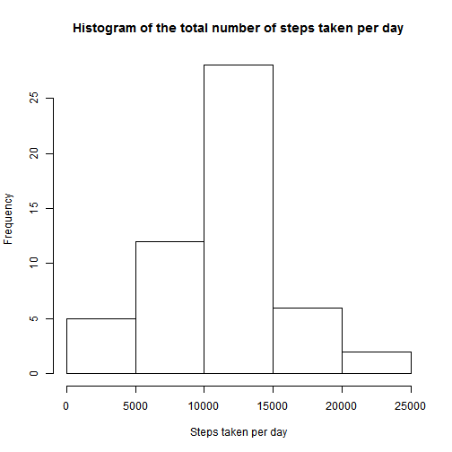
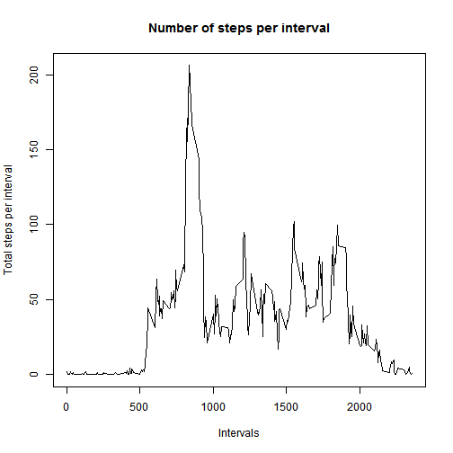
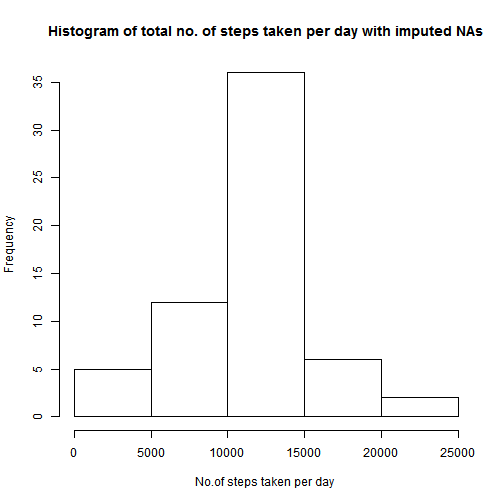
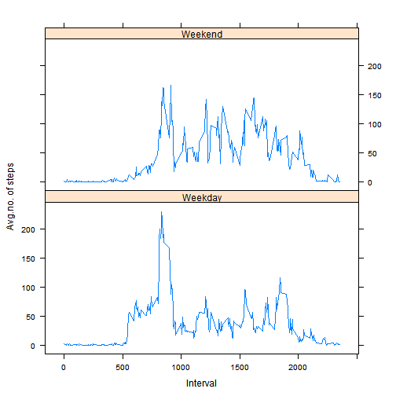

Reading the data file

```r
data <- read.csv("activity.csv", header = TRUE, sep = ',')
```
Loading packages required

```r
library(lubridate)

library(lattice)
```
Changing the format of date from factor to date 

```r
data$date<-ymd(as.character(data$date))
```
Data preparation for computing total no. of steps taken per day

```r
library(dplyr)
activity_date <- group_by(data, date)
activity_summarise <- summarize(activity_date,steps=sum(steps))
```
filtering out Nas

```r
activity_summary<-activity_summarise %>%filter(!is.na(steps))
```
plotting histogram the total number of steps taken each day

```r
hist(activity_summary$steps,xlab="Steps taken per day",main="Histogram of the total number of steps taken per day")
```


Computing and printing mean and median of the total number of steps taken per day

```r
mean_steps <- mean(activity_summary$steps)
median_steps <- median(activity_summary$steps)
mean_steps
```

```
## [1] 10766.19
```

```r
median_steps
```

```
## [1] 10765
```
The mean of the total number of steps taken per day is 1.0766189 &times; 10<sup>4</sup>.
The median of the total number of steps taken per day is 10765.

Data preparation for average daily activity pattern

```r
activity_interval <- group_by(data, interval)%>%filter(!is.na(steps))
activity_mean_steps<-summarize(activity_interval,steps=mean(steps))
```
plotting time series plot of interval and  average number of steps taken across all days

```r
plot(activity_mean_steps$interval, activity_mean_steps$steps, type = "l", xlab = "Intervals", ylab = "Total steps per interval", main = "Number of steps per interval")
```



Finding and printing the interval with maximum mean no. of steps

```r
interval_maxm <- activity_mean_steps[which.max(activity_mean_steps$steps),]
interval_maxm
```

```
## # A tibble: 1 x 2
##   interval    steps
##      <int>    <dbl>
## 1      835 206.1698
```
The 5-minute interval that contains maximum mean number of steps across all the days in the dataset is 835 and maxm no. of steps is 206.1698113

Calculating total no. of Nas in dataset

```r
total_no_na<-sum(is.na(data$steps))
total_no_na
```

```
## [1] 2304
```
The total number rows with missing values is 2304

Replacing missing values i.e imputing Nas in steps by taking mean for that interval

```r
nas <- is.na(data$steps)
mean_interval <- tapply(data$steps, data$interval, mean, na.rm=TRUE, simplify=TRUE)
data$steps[nas] <- mean_interval[as.character(data$interval[nas])]
```

Plotting the histogram of No. of steps per day with imputed Na values of steps

```r
activity_steps_impna <- data%>%group_by(date) %>%  summarize(steps = sum(steps))
hist(activity_steps_impna$steps,xlab="No.of steps taken per day ",main="Histogram of total no. of steps taken per day with imputed NAs")
```



Calculating mean and median total number of steps taken per day with imputed Nas

```r
mean_steps_imp <- mean(activity_steps_impna$steps)
median_steps_imp <- median(activity_steps_impna$steps)
mean_steps_imp
```

```
## [1] 10766.19
```

```r
median_steps_imp
```

```
## [1] 10766.19
```
 Mean of the total number of steps  taken per day with imputed nas is 
 1.0766189 &times; 10<sup>4</sup>.
The median of the total number of steps taken per day with imputed nas is 1.0766189 &times; 10<sup>4</sup>.

Impact:Both the mean and median have become equal and is same as the earlier mean value without Nas.

Creating a new variable day_type

```r
data<-mutate(data,day_type=ifelse(weekdays(data$date) == "Saturday" | weekdays(data$date) == "Sunday", "Weekend", "Weekday"))
data$day_type <- as.factor(data$day_type)
```
Data preparation for panel plot

```r
data_steps_interval_daytype <- aggregate(steps ~ interval + day_type, data =data, FUN = mean)
```
Time series plot between interval and average no. of steps for weekend and weekday

```r
xyplot(steps~interval|day_type,data=data_steps_interval_daytype,type="l",lwd=1,xlab="Interval",ylab="Avg.no. of steps",layout=c(1,2))
```


Observed differences in activity patterns between weekdays and weekends
a.The maximum value of average no. of steps is higher for weekdays than weekend.
b.Variations in average no. of steps for weekend is more than weekdays.
